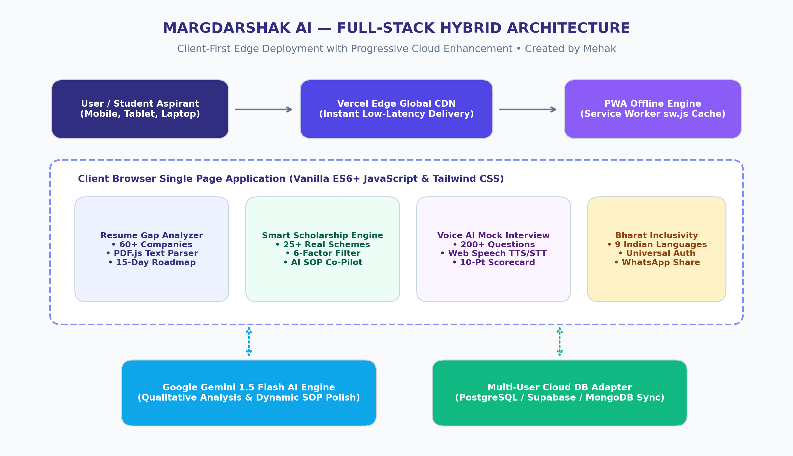
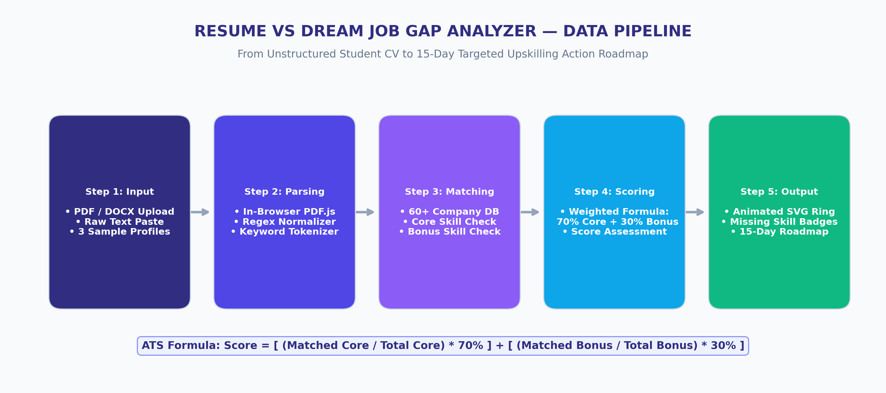
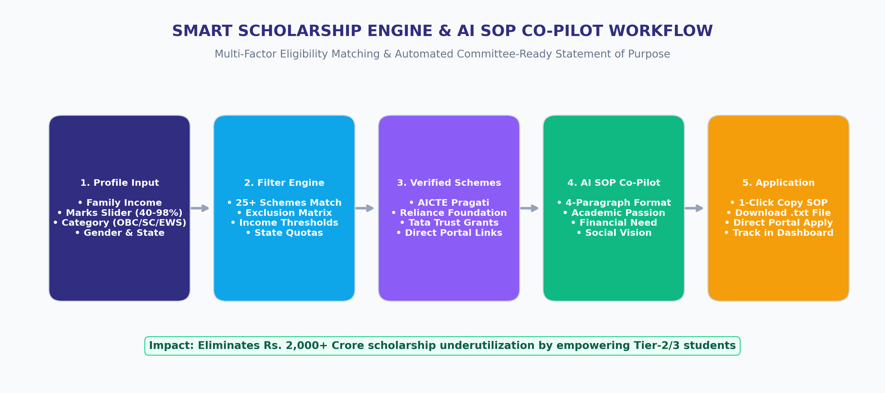
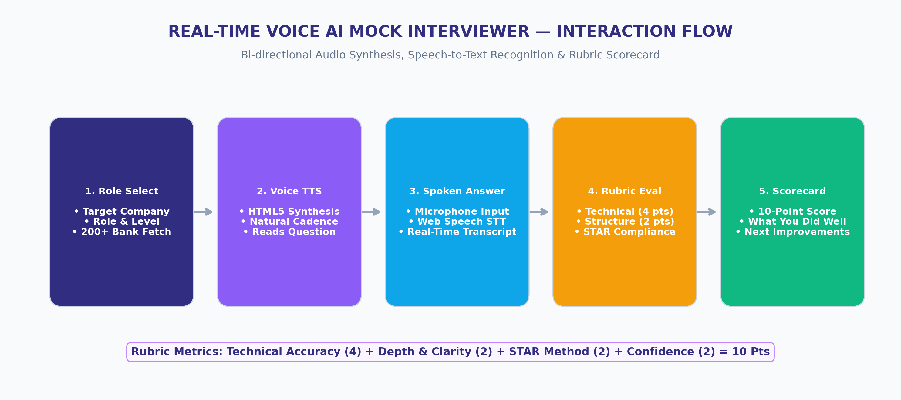
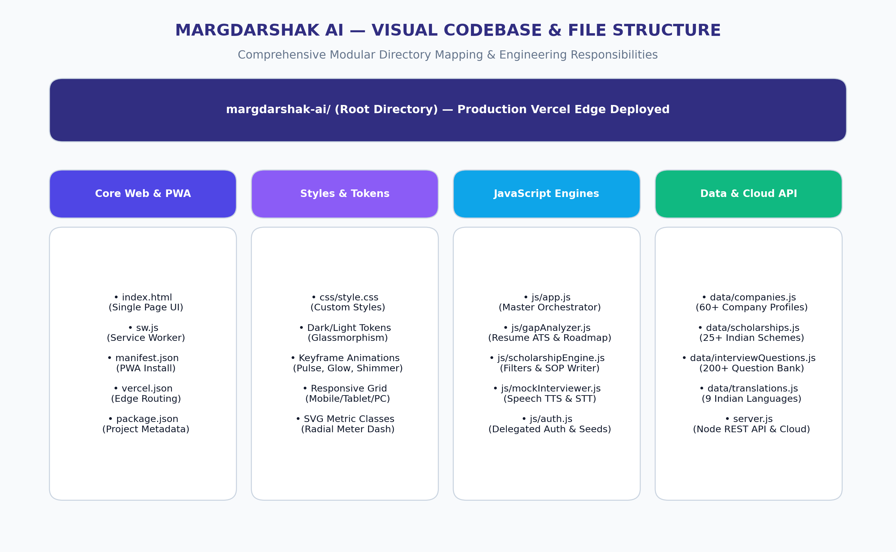

# MARGDARSHAK AI (मार्गदर्शक AI)
## Comprehensive Technical Project & System Architecture Report
> **Project Edition:** Smart India Hackathon (SIH 2024 Edition)  
> **Founder & Lead Developer:** Mehak  
> **Official Tagline:** *"From Classroom to Dream Career — Guided by AI"*  
> **Live Production Platform:** [https://margdarshak-ai-khaki.vercel.app](https://margdarshak-ai-khaki.vercel.app)  
> **Official GitHub Repository:** [https://github.com/Mehak237/margdarshak-ai](https://github.com/Mehak237/margdarshak-ai)  
> **Report Target Audience:** Academic Mentors, Faculty Evaluators, Placement Heads & SIH Jury  

---

## Table of Contents
1. [Executive Summary & Ground Realities](#1-executive-summary--ground-realities)
2. [System Architecture & Data Flow (Diagram)](#2-system-architecture--data-flow)
3. [Resume vs. Dream Job Gap Analyzer Pipeline (Diagram)](#3-resume-vs-dream-job-gap-analyzer-pipeline)
4. [Smart Scholarship Engine & AI SOP Co-Pilot (Diagram)](#4-smart-scholarship-engine--ai-sop-co-pilot)
5. [Voice AI Mock Interviewer Audio Flow (Diagram)](#5-voice-ai-mock-interviewer-audio-flow)
6. [Visual Codebase & File Structure Mapping (Diagram)](#6-visual-codebase--file-structure-mapping)
7. [Codebase Directory Table & File Responsibilities](#7-codebase-directory-table--file-responsibilities)
8. [Mathematical Formulations & Scoring Algorithms](#8-mathematical-formulations--scoring-algorithms)
9. [Social Impact, NEP 2020 & Viksit Bharat Alignment](#9-social-impact-nep-2020--viksit-bharat-alignment)
10. [Official Project Certification & Mentor Review](#10-official-project-certification--mentor-review)

---

## 1. Executive Summary & Ground Realities

In India's higher education system, over **1.5 million engineering and degree students graduate annually**. Despite this massive volume, national surveys (including the Wheebox India Skills Report) reveal that **less than 45% of graduating students from Tier-2 and Tier-3 colleges possess industry-ready technical, behavioral, and communication proficiencies**.

```
┌────────────────────────────────────────────────────────────────────────────┐
│                    THE TIER-2 / TIER-3 STUDENT PARADOX                     │
└────────────────────────────────────────────────────────────────────────────┘
         │
         ├── 1. The Resume Gap:
         │      Generic ATS resumes with irrelevant buzzwords result in 
         │      instant rejection from 60+ top recruiters.
         │
         ├── 2. The Financial Barrier:
         │      Students take high-interest loans while Rs. 2,000+ Crores 
         │      in verified scholarships remain undiscovered.
         │
         ├── 3. The Interview Hesitation:
         │      Commercial coaching charges Rs. 1,500 - Rs. 3,000/hr, 
         │      locking out humble economic background students.
         │
         └── 4. The Linguistic Divide:
                Quality placement coaching is predominantly in English, 
                leaving vernacular students struggling during campus drives.
```

**Margdarshak AI** is an end-to-end, zero-cost, browser-based career co-pilot architected and developed by **Mehak**. It eliminates these bottlenecks by providing instant ATS gap analysis across 60+ top Indian employers, 25+ verified scholarships with an AI Statement of Purpose (SOP) writer, interactive voice AI mock interviews with real-time scoring, 9 Indian languages, and an offline-resilient PWA architecture.

---

## 2. System Architecture & Data Flow

Margdarshak AI employs a **Client-First Hybrid Edge Architecture**. The application executes 100% client-side by default—delivering **0ms cold starts**, total student data privacy (PDFs never leave local device memory), and zero operational server costs—while offering progressive cloud enhancement via Google Gemini 1.5 Flash and multi-user database sync.


*Figure 1: Full-Stack Hybrid Architecture — Client-First SPA + Progressive Cloud AI*

### Key Architectural Pillars:
1. **Zero External Build Step:** Written in clean, vanilla ES6+ JavaScript and Tailwind CSS. Eliminates heavy bundlers (Webpack/Vite) and guarantees sub-second page loads (<0.8s).
2. **Zero-Data-Leak Privacy:** PDF resumes are parsed locally in browser memory via PDF.js worker; personal CV files are never transferred to third-party servers.
3. **Dual Storage Pattern:** All student scans, targets, saved scholarships, and interview results persist immediately in `localStorage` and asynchronously synchronize to cloud databases (PostgreSQL/Supabase & MongoDB Atlas).

---

## 3. Resume vs. Dream Job Gap Analyzer Pipeline

The Gap Analyzer compares applicant skills against verified hiring benchmarks for **60+ premier employers in India** (Google, Amazon, TCS Ninja/Digital, Infosys SE/DSE, Wipro, Flipkart, Swiggy, Goldman Sachs) categorized into 5 competitive tiers.


*Figure 2: Resume Gap Analysis Data Pipeline — From Input to 15-Day Action Roadmap*

### Algorithmic Mechanics:
- **Client-Side Text Extraction:** Extracts text right in the browser via an embedded `PDF.js` worker without server upload latency.
- **Weighted Dual-Tier ATS Formula:** Mathematically separates **Core Must-Have Skills (70%)** from **Bonus Edge Skills (30%)**.
- **Dynamic SVG Radial Score Ring:** Calculates exact SVG `stroke-dashoffset` to smoothly animate student readiness from 0% to 100%.
- **15-Day Personalized Roadmap:** Structured into 3 actionable phases:
  - *Phase 1 (Days 1–5):* Foundation repair on missing critical skills.
  - *Phase 2 (Days 6–10):* Hands-on portfolio project implementation.
  - *Phase 3 (Days 11–15):* Mock coding questions, system design, and interview practice.
- **Elevator Pitch Evaluator:** NLP diagnostic for the candidate's 60-second 'Tell Me About Yourself' opening pitch.

---

## 4. Smart Scholarship Engine & AI SOP Co-Pilot

Over **Rs. 2,000 Crores** in central, state, and corporate scholarship funds go unused every year because students are unaware of deadlines, income thresholds, or cannot draft an eloquent Statement of Purpose (SOP).


*Figure 3: Smart Scholarship Multi-Factor Filter & AI Statement of Purpose Co-Pilot Workflow*

### Key Capabilities:
- **25+ Verified Indian Schemes:** Curated schemes including AICTE Pragati for Girls (Rs. 50,000/yr), Reliance Foundation (Rs. 2,00,000), Tata Trust Medical & Engineering Grants, NSP Central Sector, and Post-Matric SC/ST/OBC.
- **6-Dimensional Real-Time Filter:** Filters simultaneously by Family Income (Rs. 1.5L to Rs. 8L EWS ceiling), Academic Percentage (40% to 98% slider), Social Category (General/OBC/SC/ST/EWS), Gender, Domicile State, and Degree Level.
- **Committee-Ready 4-Paragraph SOP Writer:** Auto-generates eloquent Statements of Purpose articulating:
  1. *Academic passion & background*
  2. *Financial hardships & family resilience*
  3. *Career aspirations & tech focus*
  4. *Social commitment to give back to the nation*

---

## 5. Voice AI Mock Interviewer Audio Flow

Commercial mock interview services charge Rs. 1,500 – Rs. 3,000 per hour. Margdarshak AI delivers an interactive, voice-driven mock interview simulator 100% free right in the browser.


*Figure 4: Bi-Directional Speech Synthesis (TTS) & Speech Recognition (STT) Interview Pipeline*

### Technical Voice Implementation:
- **Speech Synthesis (Voice Interviewer):** Vocalizes company-tailored interview questions using the HTML5 `SpeechSynthesisUtterance` API.
- **Speech-to-Text Recognition:** Listens to candidate answers via the browser microphone using `webkitSpeechRecognition`, transcribing speech into structured text.
- **10-Point Scorecard Rubric:** Evaluates answers on Technical Accuracy (4 pts), Structure & Depth (2 pts), STAR Method Compliance (2 pts), and Delivery Confidence (2 pts), with actionable constructive feedback.

---

## 6. Visual Codebase & File Structure Mapping

The repository follows a clean, modular architecture separating layout, calculation engines, normalized datasets, and cloud configurations.


*Figure 5: Visual Codebase Architecture & Modular File Responsibilities*

---

## 7. Codebase Directory Table & File Responsibilities

| File / Path | Module Role | Key Technical Functionality |
|---|---|---|
| **`index.html`** | SPA Layout | Full semantic single-page application UI, modular sections, navigation, and modals. |
| **`css/style.css`** | Styles & Theme | Custom dark/light glassmorphism design tokens, keyframe animations, and responsive utilities. |
| **`js/app.js`** | Master Controller | Client-side routing, tab coordination, theme switcher, and WhatsApp share handler. |
| **`js/gapAnalyzer.js`** | Gap Engine | Resume text extraction (PDF.js), 60+ company gap matcher, dynamic SVG score ring, and 15-day roadmap. |
| **`js/scholarshipEngine.js`** | Scholarship Engine | Multi-factor scholarship query engine and committee-ready 4-paragraph AI SOP co-pilot. |
| **`js/mockInterviewer.js`** | Voice Interviewer | Web Speech API voice synthesis, microphone STT, and 10-point scorecard rubric. |
| **`js/auth.js`** | Auth Controller | Universal document-delegated authentication, session management, and demo student seeds. |
| **`data/companies.js`** | Dataset | 60+ curated Indian tech companies with core & bonus skill definitions across 5 tiers. |
| **`data/scholarships.js`** | Dataset | 25+ verified Indian scholarships with live application links and eligibility rules. |
| **`data/translations.js`** | Localization | Multilingual key-value dictionary for 9 Indian languages (English, Hindi, Hinglish, etc.). |
| **`server.js`** | Backend API | Native Node.js REST API with zero external dependencies and cloud DB sync adapters. |
| **`sw.js` & `manifest.json`** | PWA Engine | Service worker cache-first offline strategy and standalone web app installation manifest. |
| **`vercel.json`** | Edge Routing | Static edge routing configuration for zero-downtime production deployment. |

---

## 8. Mathematical Formulations & Scoring Algorithms

The candidate match score is calculated using a dual-weighted polynomial:

$$\text{Score}_{\text{ATS}} = \min\left(100, \left[ \left( \frac{\sum_{i=1}^{N_c} w_c \cdot \mathbb{I}(c_i \in R)}{\sum_{i=1}^{N_c} w_c} \times 0.70 \right) + \left( \frac{\sum_{j=1}^{N_b} w_b \cdot \mathbb{I}(b_j \in R)}{\sum_{j=1}^{N_b} w_b} \times 0.30 \right) \right] \times 100 \right)$$

- **Score ≥ 80% (Green Tier):** Ready for Selection — Strongly aligned; ready to apply immediately.
- **Score 60% – 79% (Amber Tier):** Competitive with Gaps — Needs 5–10 days targeted gap closure using roadmap.
- **Score < 60% (Rose Tier):** Fundamental Foundations Required — Complete Phase 1 core curriculum.

---

## 9. Social Impact, NEP 2020 & Viksit Bharat Alignment

- **Viksit Bharat 2047 & NEP 2020:** Democratizes high-tier placement coaching for 10M+ Indian students in rural and non-metro colleges, breaking linguistic and economic barriers.
- **Economic ROI:** Elevating a candidate from service baseline (Rs. 3.5 LPA) to a product/digital tier (Rs. 7.5 LPA) unlocks over **Rs. 25 Lakhs** in incremental lifetime earnings.
- **Women in Tech Empowerment:** Actively flags high-value female schemes (AICTE Pragati) to boost gender equity in engineering.

---

## 10. Official Project Certification & Mentor Review

This technical report certifies that **Margdarshak AI** has been conceptualized, architected, engineered, and deployed live to production by **Mehak** as an original technological innovation for the **Smart India Hackathon (SIH 2024 Edition)**.

```
__________________________________              __________________________________
Mehak                                           Faculty / Mentor Signature
Founder & Lead Developer • Margdarshak AI       Academic Project Evaluator / SIH Committee
SIH 2024 Edition                                Department of Computer Science & Engineering
```

---
*Report certified and published for Academic Review, SIH 2024 Evaluation, and University Demonstration.*
